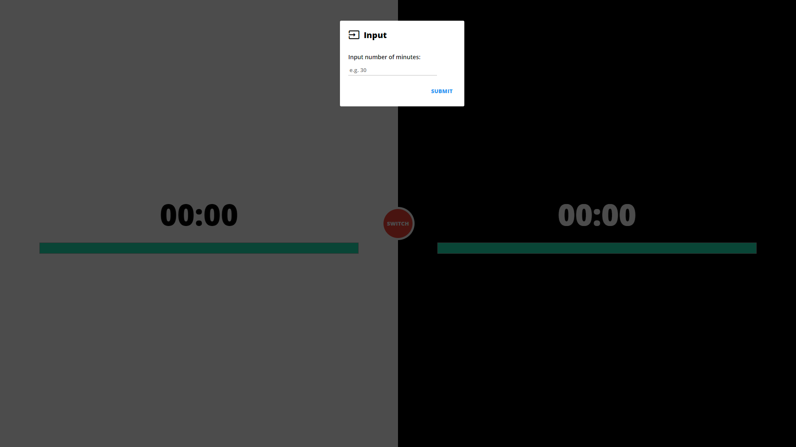

# Chess Timer

At this stage, it sounds kinda common, but this is a "simple web application" that allows you to time your chess play.

## How to Use

1. Download ZIP or clone directory;
2. Open the *index.html* in your browser;
3. Specify the number of minutes in the popup;
4. White goes first!
5. As soon as you make a move, hit the **SWITCH** button (it will change its border colour);
6. Continue until one of you loses by skill or by time (when time's up, you'll see a popup notification);
7. To start another timer, *refresh* the page;

## Screenshot Guide

## Contact

For any personal or business enquiries:

+ Email: *sharp.vik@gmail.com*
+ [Twitter](https://twitter.com/sharp_vik)
+ [VK](https://vk.com/perigrinus)
+ [Instagram](https://www.instagram.com/viktooooor)